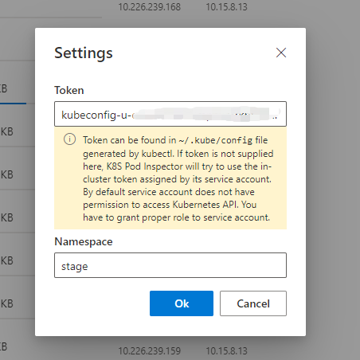
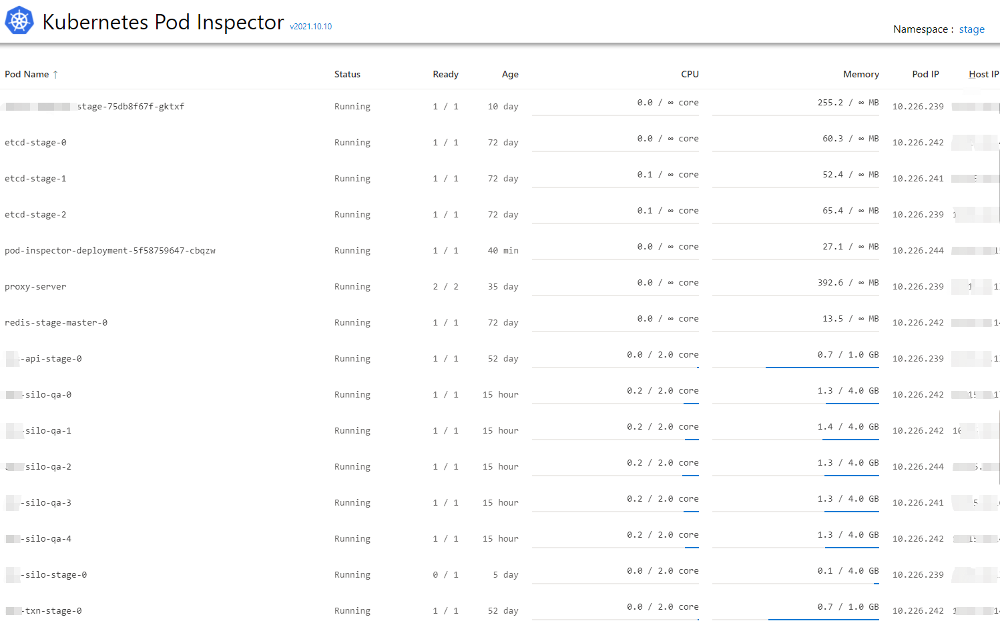
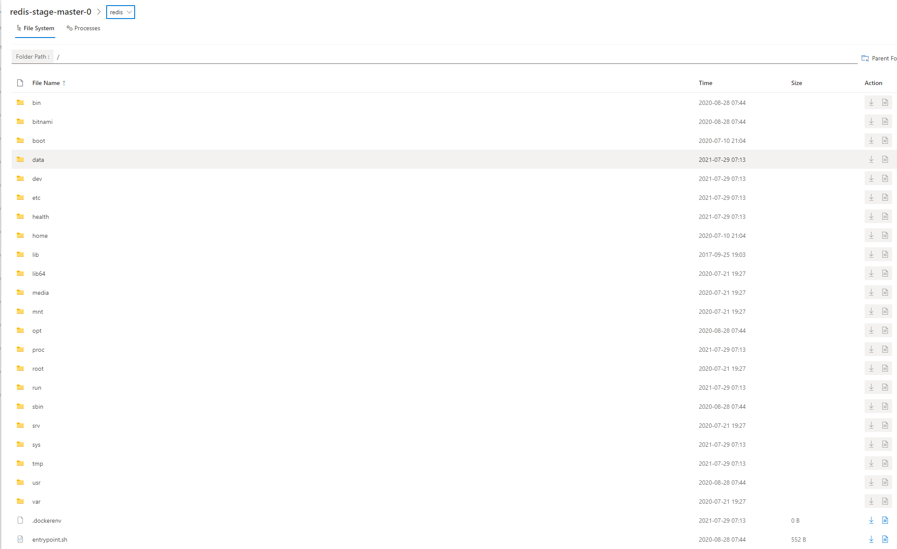
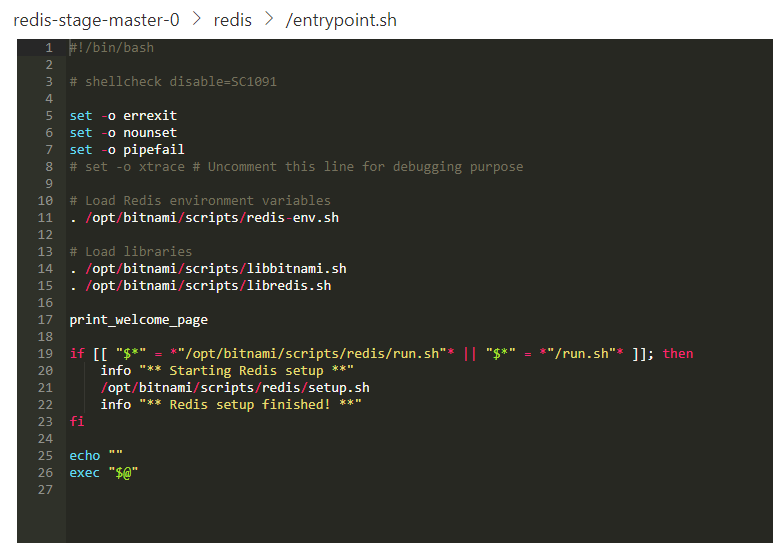
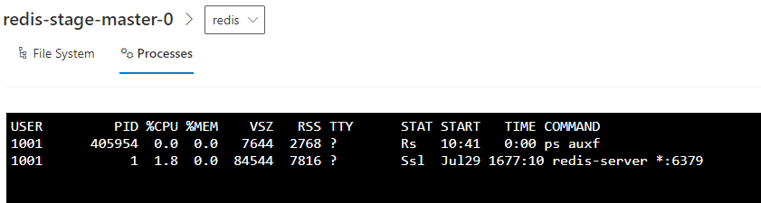

# Kubernetes Pod Inspector

Unlike other dashboardes for Kubernetes(Lens / Rancher / etc), Kubernetes Pod Inspector allows to check the file system and processes within running Linux pods without using kubectl. 
This is useful when we want to check the files within volumes mounted by pods


## How to Deploy


The docker image is available at [docker.io/wangjia184/pod-inspector](https://hub.docker.com/repository/docker/wangjia184/pod-inspector). 
Typically, it can be deployed into K8S cluster with following yaml.

```yaml
apiVersion: apps/v1
kind: Deployment
metadata:
  name: pod-inspector-deployment
  labels:
    app: pod-inspector
spec:
  replicas: 1
  selector:
    matchLabels:
      app: pod-inspector
  template:
    metadata:
      labels:
        app: pod-inspector
    spec:
      containers:
      - name: pod-inspector
        image: docker.io/wangjia184/pod-inspector:latest
        args: ["-port", "8080", "-user", "", "-password", ""]
        ports:
        - containerPort: 8080 
        env:
          - name: K8S_NODE_NAME
            valueFrom:
              fieldRef:
                fieldPath: spec.nodeName
          - name: NODE_IP
            valueFrom:
              fieldRef:
                fieldPath: status.hostIP
          - name: POD_NAME
            valueFrom:
              fieldRef:
                fieldPath: metadata.labels['statefulset.kubernetes.io/pod-name']
          - name: POD_NAMESPACE
            valueFrom:
              fieldRef:
                fieldPath: metadata.namespace
          - name: POD_IP
            valueFrom:
              fieldRef:
                fieldPath: status.podIP
          - name: POD_SERVICE_ACCOUNT
            valueFrom:
              fieldRef:
                fieldPath: spec.serviceAccountName
        imagePullPolicy: Always
```

It listens on port 8080 for HTTP service. You can specify `user` and `password` in arguments to enable http authentication.

Next, expose port 8080 so that you can access it. Here is an example:

```yaml
apiVersion: v1
kind: Service
metadata:
  name: pod-inspector
spec:
  selector:
    app: pod-inspector
  ports:
    - name: http
      protocol: TCP
      port: 80
      targetPort: 8080
  type: ClusterIP
---
  apiVersion: networking.k8s.io/v1
  kind: Ingress
  metadata:
    name: pod-inspector
  spec:
    rules:
    - host: your.kubernetes.cluster.domain-name.local
      http:
        paths:
        - path: /
          pathType: Prefix
          backend:
            service:
              name: pod-inspector
              port:
                number: 80

```

Finally you should be able to access the web site. By filling the token and namespace of K8S cluster, it will connect to the same cluster the pod is running.  Token can be retrieved in `~/.kube/config` file.



## Use a dedicated service account

If your cluster uses RBAC, you can also run the inspector with a dedicated service account and grant proper roles. 
Here is an example to create the service account and its role.

```yaml
apiVersion: v1
kind: ServiceAccount
metadata:
  name: pod-inspector
automountServiceAccountToken: true
---
apiVersion: rbac.authorization.k8s.io/v1
kind: Role
metadata:
  name: pod-inspector
rules:
- apiGroups: [""] # "" indicates the core API group
  resources: ["pods"]
  verbs: ["get", "watch", "list"]
- apiGroups: [""]
  resources: ["pods/exec"]
  verbs: ["create"]
---
apiVersion: rbac.authorization.k8s.io/v1
kind: RoleBinding
metadata:
  name: inspect-pods
subjects:
- kind: ServiceAccount
  name: pod-inspector # service account name
roleRef:
  kind: Role
  name: pod-inspector # role name
  apiGroup: rbac.authorization.k8s.io
```

Then specifiy the service account in your pod.

```yaml
apiVersion: apps/v1
kind: Deployment
metadata:
  name: pod-inspector-deployment
  labels:
    app: pod-inspector
spec:
  replicas: 1
  selector:
    matchLabels:
      app: pod-inspector
  template:
    metadata:
      labels:
        app: pod-inspector
    spec:
      serviceAccountName: pod-inspector # service account
      containers:
      - name: pod-inspector
        image: docker.io/wangjia184/pod-inspector:latest
        args: ["-port", "8080", "-user", "admin", "-password", "654321"]
        ports:
        - containerPort: 8080 
        env:
          - name: K8S_NODE_NAME
            valueFrom:
              fieldRef:
                fieldPath: spec.nodeName
          - name: NODE_IP
            valueFrom:
              fieldRef:
                fieldPath: status.hostIP
          - name: POD_NAME
            valueFrom:
              fieldRef:
                fieldPath: metadata.labels['statefulset.kubernetes.io/pod-name']
          - name: POD_NAMESPACE
            valueFrom:
              fieldRef:
                fieldPath: metadata.namespace
          - name: POD_IP
            valueFrom:
              fieldRef:
                fieldPath: status.podIP
          - name: POD_SERVICE_ACCOUNT
            valueFrom:
              fieldRef:
                fieldPath: spec.serviceAccountName
        imagePullPolicy: Always
```

## Screenshots


### List of Pods


### Files within Pods


### View File (or you can download as well)


### Check Processes


